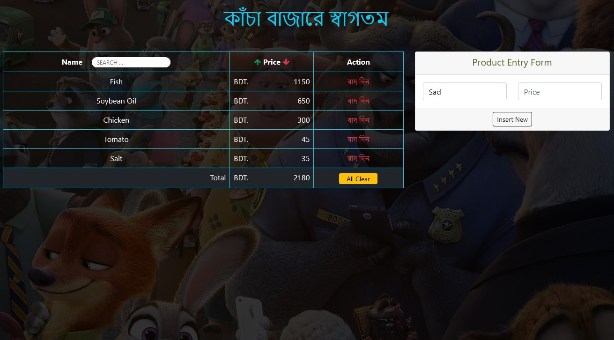

# কাঁচা বাজার

#### Work Break down Steps
1.  Create product
    1.  Receive Inputs
    2.  Validate Inputs
    3.  Store the Product
        1.  Add product to the UI
        2.  Reset Inputs after successful insert
        3.  Add items info as an object in Product list Array Storage
2.  Delete product
    1.  select a product
    2.  delete it from UI
    3.  delete it from Product list Array Storage